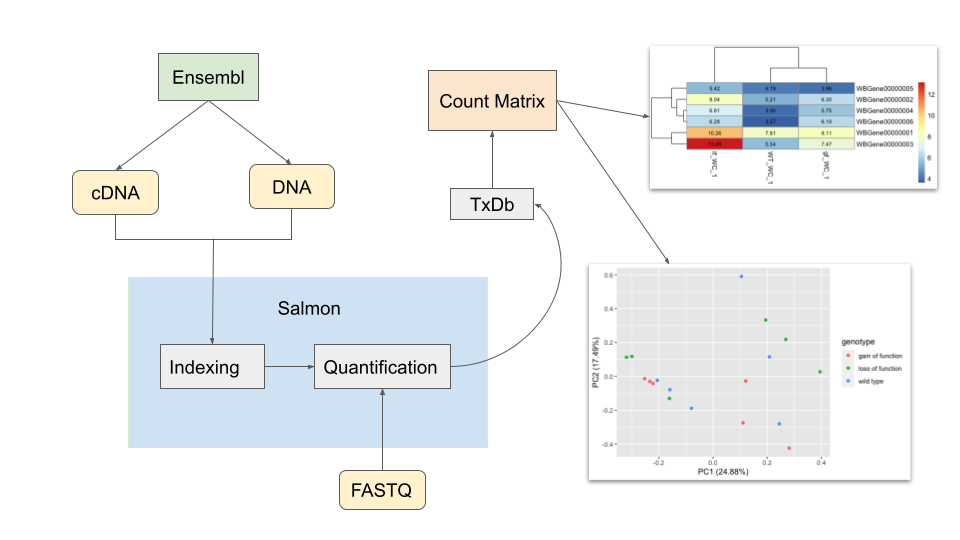

<!-- README.md is generated from README.Rmd. Please edit that file -->

```{r, include = FALSE}
knitr::opts_chunk$set(
  collapse = TRUE,
  comment = "#>",
  fig.path = "man/figures/README-",
  out.width = "100%"
)
```

# AbunRNA

<!-- badges: start -->
<!-- badges: end -->


## Description

`AbunRNA` is an R package focuses on the commonly used RNAseq analysis pipelines including indexing, quantification, and to the downstream expression analysis. This packages is friendly to users with lack or no experience in command line usage, but can still access the high-efficiency sequence mapping software i.e. Salmon. The R-based pipeline can access the available cDNA, DNA and transcriptome data from Ensembl, generate a count matrix indicating the expression abundance of each genes within each sample, plot a heatmap to visualize the abundance among wild type and mutants, and finally perform principle component analysis on the count matrix for more exploratory information. The `AbunRNA` package is developed using `R version 4.2.1 (2022-06-23)`, `Platform: x86_64-apple-darwin17.0 (64-bit)` and `Running under: macOS Ventura 13.0`.

## Installation

To install the latest version of the package:

``` r
require("devtools")
devtools::install_github("zhangchengyue/AbunRNA", build_vignettes = TRUE)
library("AbunRNA")
```

To run shinyApp:
Under construction


Sometimes errors about dependencies are showing up, usually that would happen for the following packages not previously downloaded in your RStudio: tximport, biomaRt, GenomicFeatures, AnnotationDbi.

To solve this, run the following code to download these packages first, then re-install __*AbunRNA*__.
``` r
if (! requireNamespace("BiocManager", quietly = TRUE)) {
  install.packages("BiocManager")
}

if (! requireNamespace("tximport", quietly = TRUE)) {
  BiocManager::install("tximport")
}

if (! requireNamespace("biomaRt", quietly = TRUE)) {
  BiocManager::install("biomaRt")
}

if (! requireNamespace("GenomicFeatures", quietly = TRUE)) {
  BiocManager::install("GenomicFeatures")
}

if (! requireNamespace("AnnotationDbi", quietly = TRUE)) {
  BiocManager::install("AnnotationDbi")
}

```

## Overview

``` r
ls("package:AbunRNA")
data(package = "AbunRNA") 
```
`AbunRNA` contains functions to: 

1. install the popularly used Salmon software through bioconda (See function __*installSalmon*__)
2. directly obtain reference transcriptome from Ensembl database (See function __*obtainCDNA*__, __*obtainDNA*__, and __*obtainGTF*__)
3. run quantification through Salmon (See function __*quantification*__)
4. generate TxDb object for storing transcript annotations (See function __*txdbObj*__)
5. generate the count matrix from TxDb and optionally plot the heatmap to visualize abundance (See function __*generateMatrix*__)
6. performs principle component analysis for the matrix, and plot the graph to further visualize the variation in expression abundance among wild type and mutant samples.(See function __*plotPCA*__)
```
browseVignettes("AbunRNA")
```

An overview of the package is illustrated below. 




## Contributions

The author of the package is ChengYue Zhang. The `obtainGTF()`, `obtainDNA()` and `obtainCDNA()` functions makes use of `rvest` package to web scrape from online database. The *txdbObj* function makes use of `makeTxDbFromGFF()` function from `GenomicFeatures` package to create a txdb object from GTF file. The `generateMatrix()` function uses pheatmap function from `pheatmap` R package to plot the heatmap. The `stats` and `ggplot2` R packages are used for principle component analysis in `plotPCA()` function. The `rstudioapi` CRAN package is used to send commands to terminal for downloading Salmon software in `installSalmon()` function, as well as running Salmon commands for indexing and quantification in `quantification()` function.

## References

Patro, R., Duggal, G., Love, M. et al. Salmon provides fast and bias-aware quantification of transcript expression. Nat Methods 14, 417–419 (2017).https://doi.org/10.1038/nmeth.4197

Ushey K, Allaire J, Wickham H, Ritchie G (2022). rstudioapi: Safely Access the RStudio API. https://CRAN.R-project.org/package=rstudioapi

Ensembl 2022, Nucleic Acids Research, Volume 50, Issue D1,7 January 2022, Pages D988–D995, https://doi.org/10.1093/nar/gkab1049

Durinck S, Spellman P, Birney E, Huber W (2009). “Mapping identifiers for the integration of genomic datasets with the R/Bioconductor package biomaRt.” Nature Protocols, 4, 1184–1191.

Durinck S, Moreau Y, Kasprzyk A, Davis S, De Moor B, Brazma A, Huber W (2005). “BioMart and Bioconductor: a powerful link between biological databases and microarray data analysis.” Bioinformatics, 21, 3439–3440.

Wickham H, François R, Henry L, Müller K (2022). dplyr: A Grammar of Data Manipulation. https://CRAN.R-project.org/package=dplyr

Müller K, Wickham H (2022). tibble: Simple Data Frames. https://CRAN.R-project.org/package=tibble

Lawrence M, Huber W, Pagès H, Aboyoun P, Carlson M, Gentleman R, Morgan M, Carey V (2013). “Software for Computing and Annotating Genomic Ranges.” PLoS Computational Biology, 9. doi: 10.1371/journal.pcbi.1003118, http://www.ploscompbiol.org/article/info%3Adoi%2F10.1371%2Fjournal.pcbi.1003118

Wickham H (2022). rvest: Easily Harvest (Scrape) Web Pages. https://CRAN.R-project.org/package=rvest 

Wickham H (2022). stringr: Simple, Consistent Wrappers for Common String Operations. https://CRAN.R-project.org/package=stringr

Wickham H (2016). ggplot2: Elegant Graphics for Data Analysis. Springer-Verlag New York. ISBN 978-3-319-24277-4.  https://CRAN.R-project.org/package=ggplot2

R Core Team (2013). R: A language and environment for statistical computing. R Foundation for Statistical Computing, Vienna, Austria. ISBN 3-900051-07-0.http://www.R-project.org/

## Acknowledgements

This package was developed as part of an assessment for 2022 BCB410H: Applied Bioinformatics course at the University of Toronto, Toronto, CANADA. `AbunRNA` welcomes issues, enhancement requests, and other contributions. To submit an issue, use the GitHub issues.


