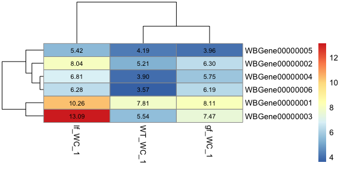
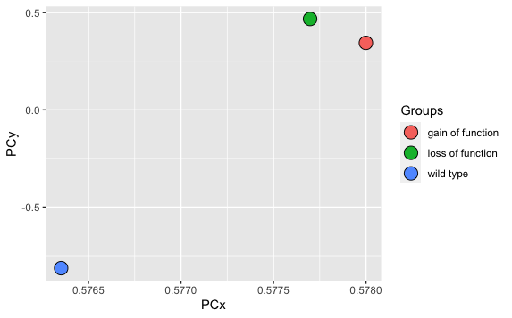

```{r setup, include=FALSE}
library(knitr)
opts_chunk$set(fig.align = "center", 
               out.width = "90%",
               fig.width = 6, fig.height = 5.5,
               dev.args=list(pointsize=10),
               par = TRUE, # needed for setting hook 
               collapse = TRUE, # collapse input & ouput code in chunks
               warning = FALSE)
knit_hooks$set(par = function(before, options, envir)
  { if(before && options$fig.show != "none") 
       par(family = "sans", mar=c(4.1,4.1,1.1,1.1), mgp=c(3,1,0), tcl=-0.5)
})
set.seed(1) # for exact reproducibility
```
       
## Introduction

`AbunRNA` is an R package developed to wrap up the commonly used RNA-seq analysis pipelines from the initial software download, search and download from Ensembl database, indexation and quantification on transcript expression, then to generate count matrix and perform principle component analysis.

To download **AbunRNA**, use the following commands:

``` r
require("devtools")
install_github("zhangchengyue/AbunRNA", build_vignettes = TRUE)
library("AbunRNA")
```

To list all sample functions available in the package:
``` r
ls("package:AbunRNA")
```

To list all sample datasets available in the package:
``` r
data(package = "AbunRNA")
```

<br>

## Quick Start
In order to generate a count matrix from raw, Salmon software needs to be downloaded before performing analysis. Run the following function to download Salmon through Bioconda. If conda has not been previously downloaded, the function would download conda to the home directory.

```
# Install Salmon through Bioconda
installSalmon()
```
<br>

For displaying purposes, first generate some objects. Due to limitation of system file size, only three samples are used to illustrate the usage.
```
cw1Quants <- system.file("extdata",
                         "cw1_quants",
                         "quant.sf",
                         package = "AbunRNA")

cl1Quants <- system.file("extdata",
                         "cl1_quants",
                         "quant.sf",
                         package = "AbunRNA")

cg1Quants <- system.file("extdata",
                         "cg1_quants",
                         "quant.sf",
                         package = "AbunRNA")

sfSe <- c(cw1Quants, cl1Quants, cg1Quants)
samples <- c("WT_WC_1", "lf_WC_1", "gf_WC_1")
```
### obtainCDNA
The __*obtainCDNA*__ function extracts complete cDNA fa.gz file for a specific species from Ensembl. More information could be viewed in `?obtainCDNA`.

<br>

Below is an example of running this function, which downloads release version 107 of C.elegans cDNA data:
```
obtainCDNA(species = "Caenorhabditis Elegans", wantedVersion = 107, download = F)
```

By setting `download` parameter to F, the functions only returns the name of the file to be downloaded. This is useful for checking whether it is the desired dataset, and then setting to T would download the dataset directly to the current working directory.

### obtainDNA
The __*obtainDNA*__ function downloads the DNA data of the species. More information could be viewed in `?obtainDNA`.
```
obtainDNA("Caenorhabditis Elegans", wantedVersion=107)
```

<br>

__*obtainCDNA*__ and __*obtainDNA*__ functions can be used in Salmon quantification step for mapping through quasi-map algorithm [Patro, 2017].


### obtainGTF
The __*obtainGTF*__ function downloads the reference transcriptome of the species. More information could be viewed in `?obtainGTF`.
```
obtainGTF("Caenorhabditis Elegans", wantedVersion=107)
```
The __*obtainGTF*__ function is used in `generateMatrix` function, where each sample sequence would be counted for expression of each gene, taking the GTF file from Ensembl as the reference.

### txdbObj
The __*txdbObj*__ function eases the step for importing quantification files generated by Salmon. It would automatically create an TxDb object based on the quantification files. More information could be viewed in `?txdbObj`. 

In the following example, `sfSe` is a vector containing the path to .sf files generated by Salmon. 

This can be used as a stand-alone function in the case that the reference transcriptome has not been prepared. By giving the species name, the function would automatically download the required reference transcriptome for further process.
```
txi <- txdbObj(sfSeq = sfSe,
                species = "Caenorhabditis elegans",
                release = 107,
                key = "TXNAME")
```

<br>

In another case, if there is a reference transcriptome ready to use, simply justify its path:
```
txi <- txdbObj(sfSeq = sfSe,
               refTrp = "Caenorhabditis_elegans.WBcel235.107.gtf",
               key = "TXNAME")
```

### generateMatrix
The __*generateMatrix*__ function generates a count matrix from salmon output files. It can also plot a heatmap to visualize transcript abundance among wild type and mutant if indicated. More information could be viewed in `?generateMatrix`
```
countMatrix <- generateMatrix(sfSeq = sfSe,
                              species = "Caenorhabditis Elegans",
                              sampleNames = samples,
                              outputCSV = TRUE)
```

<div style="text-align:center"></div>


### quantification
The __*quantification*__ function runs Salmon software for generating index of the reference transcriptome, and perform quantification for the input raw sequences. More information could be viewed in `?quantification`.
```
quantification(species = "Caenorhabditis Elegans",
               release = NA,
               indexName = "celegansINDEX",
               fastq = "celegans.fastq",
               quantOut = "celegansQUANT")
```


### plotPCA
performs principle component analysis on input matrix, and plot the graph to cluster among samples. If a condition matrix is provided indicating samples' genotype (i.e. wild type, gain of function, loss of function), the matrix would be used to color each sample dots based on their genotype for better visualization of the results. The `x` and `y` parameters indicates the two variables. If `x = 1` and `y = 2`, then PC1 would be the x variable and PC2 would be the y variable. More information could be viewed in `?plotPCA`.
```
# This is the condition matrix that will be used
View(conditionsDF)
graphPlot <- plotPCA(mat = AbunRNA::countMatrix, scale = TRUE,
                     conditions = AbunRNA::conditionsDF,
                     col = "genotype", x = 1, y = 2)
graphPlot$PCA
graphPlot$Plot
```
The `PCA` return value is the results of principle component analysis, and the `plot` return value is the PCA plot showing clusters of samples based on their similarity. 

With limitation of system file size, only three samples are used to illustrate the usage, thus it cannot form any clusters on the plot. However, from the graph, we can still see the difference between wild type and mutants. In real research, with large sample size, performing PCA and plotting the graph would give more information on the expression abundance among wild type and mutants.

<div style="text-align:center"></div>


<br>

## Minimal requirements
* The **R subdirectory**
* The **man subdirectory**
* **DESCRIPTION** file
* **NAMESPACE** file

### Other
* **README** file
* **LICENSE** file
* The **data** subdirectory
* The **tests** subdirectory
* The **vignettes** subdirectory
* The **inst** subdirectory

<br>
<div style="text-align:left">

## Package References

[Zhang, CY. (2022) AbunRNA: R Package For
  RNA abundance analysis. Unpublished.](https://github.com/zhangchengyue/AbunRNA)

<br>

## Other References
Patro, R., Duggal, G., Love, M. et al.Salmon provides fast and
bias-aware quantification of transcript expression. Nat Methods 14,
417–419 (2017).https://doi.org/10.1038/nmeth.4197

Ushey K, Allaire J, Wickham H, Ritchie G (2022). rstudioapi: Safely
Access the RStudio API. <https://CRAN.R-project.org/package=rstudioapi>

Ensembl 2022, Nucleic Acids Research, Volume 50, Issue D1,7 January
2022, Pages D988–D995, <https://doi.org/10.1093/nar/gkab1049>

Durinck S, Spellman P, Birney E, Huber W (2009). “Mapping identifiers
for the integration of genomic datasets with the R/Bioconductor package
biomaRt.” Nature Protocols, 4, 1184–1191.

Durinck S, Moreau Y, Kasprzyk A, Davis S, De Moor B, Brazma A, Huber W
(2005). “BioMart and Bioconductor: a powerful link between biological
databases and microarray data analysis.” Bioinformatics, 21, 3439–3440.

Wickham H, François R, Henry L, Müller K (2022). dplyr: A Grammar of
Data Manipulation. <https://CRAN.R-project.org/package=dplyr>

Müller K, Wickham H (2022). tibble: Simple Data Frames.
<https://CRAN.R-project.org/package=tibble>

Lawrence M, Huber W, Pagès H, Aboyoun P, Carlson M, Gentleman R, Morgan
M, Carey V (2013). “Software for Computing and Annotating Genomic
Ranges.” PLoS Computational Biology, 9. doi:
10.1371/journal.pcbi.1003118,
<http://www.ploscompbiol.org/article/info%3Adoi%2F10.1371%2Fjournal.pcbi.1003118>

Wickham H (2022). rvest: Easily Harvest (Scrape) Web Pages.
<https://CRAN.R-project.org/package=rvest>

Wickham H (2022). stringr: Simple, Consistent Wrappers for Common String
Operations. <https://CRAN.R-project.org/package=stringr>

Wickham H (2016). ggplot2: Elegant Graphics for Data Analysis.
Springer-Verlag New York. ISBN 978-3-319-24277-4.
<https://CRAN.R-project.org/package=ggplot2>

R Core Team (2013). R: A language and environment for statistical
computing. R Foundation for Statistical Computing, Vienna, Austria. ISBN
3-900051-07-0.http://www.R-project.org/


----

```{r}
sessionInfo()
```
